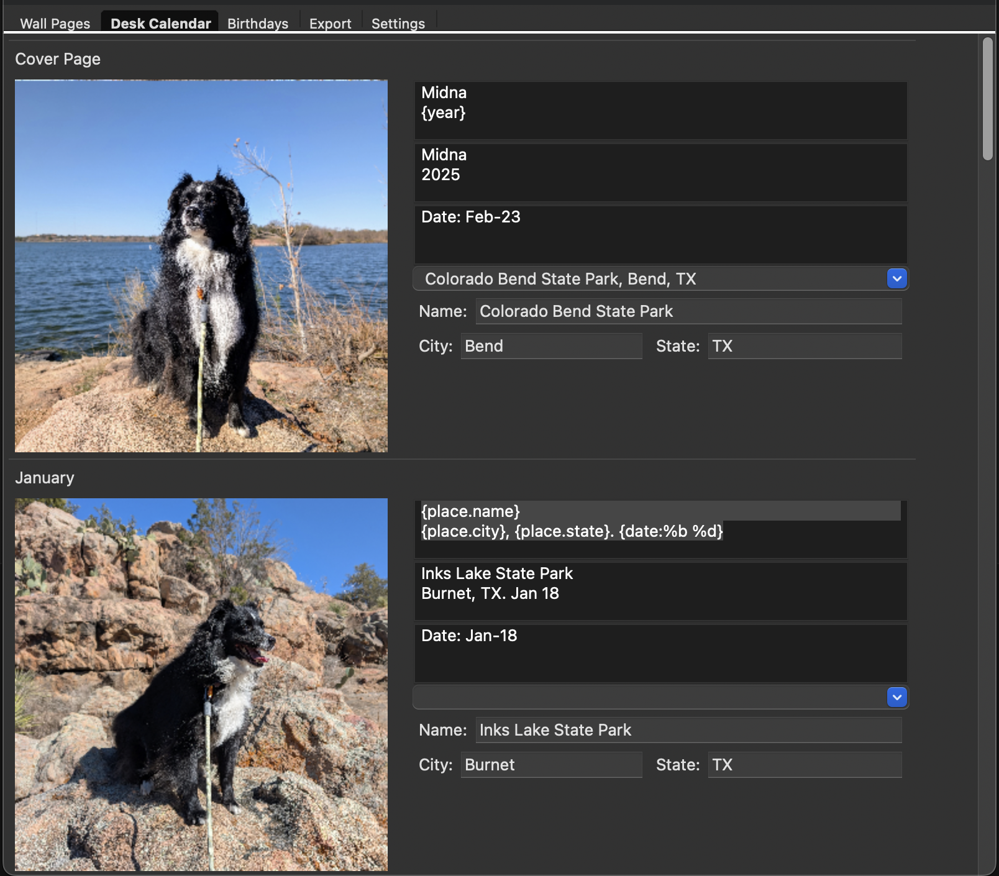

# calendar_maker

Lightweight calendar editor and exporter (GUI) for creating printable wall and desk calendars, importing birthdays from ICS files and exporting images/HTML. This repository contains the editor UI, calendar model, renderers for image/HTML output and supporting resources (fonts, images, CSS).

Key features
- GUI editor (wx) for artworks, birthdays and settings
- Import birthdays from .ics files
- Render desk and wall calendar pages to high‑resolution PNG images
- Export photo labels and birthdays to JSON (Photos.json, Birthdays.json)
- Exporter variants: Wall (v1, v2); Desk (standard, legal); Labeled Photos
- HTML/PDF hooks are present in the UI; registry provides PNG/JSON exporters today
- Moon phase and holiday integration
- **Template-based descriptions** with variable replacements:
  - `{year}` - Current calendar year
  - `{date:%b %d}` - Photo date with custom formatting
  - `{place.name}`, `{place.city}`, `{place.state}`, `{place.country}` - Place information
- **Editable place metadata** - Edit or add location details manually, even for photos without GPS data
- **Image metadata integration** - Automatically extracts date and location from photo EXIF data
- **Unsaved changes warning** - Alerts when closing with unsaved work
- **Responsive UI** - Dynamic window resizing with proper layout adaptation

Quick start (macOS)
1. Install Python 3.11+ (3.12 recommended)
2. Create and activate a virtual environment:
   python -m venv .venv
   source .venv/bin/activate
3. Install required packages:
   python -m pip install -r requirements.txt

Run
- Start the editor UI:
  python main.py

Exports and outputs
- Formats available: PNG (Wall, Desk, Photos), JSON (Photos, Birthdays)
- Wall PNG exporters:
  - `wall_cal_v1` (classic rendering)
  - `wall_cal_v2` (updated rendering)
- Desk PNG exporters:
  - `desk_cal_standard` → `tmp/DeskCal/DeskCal/Page_*.png`
  - `desk_cal_legal` (expanded 14x8.5 legal layout) → `tmp/DeskCal/DeskCalExt/Page_*.png`
- Photos PNG exporter:
  - `default` → `tmp/Photos/*.png` (options: DPI, aspect ratio, portrait, original filenames)
- JSON exporters:
  - Photos → `tmp/Photos/Photos.json`
  - Birthdays → `tmp/Birthdays/Birthdays.json`

Exporter options (high level)
- PNG (Wall): `dpi` (32–1200), `skip_months` (omit month grids)
- PNG (Desk): `dpi`
- PNG (Photos): `dpi`, `aspect_ratio` (`original`, `1:1`, `3:2`, `4:3`, `5:4`, `16:9`), `portrait`, `use_original_names`, `output_subdir`
- JSON: `filename` for output name

Using the Export panel
- Select Year, Calendar Type (`wall`, `desk`, `photos`, `birthdays`), Format (`png`, `json`), and Exporter.
- Configure options; click Export to generate files under `tmp/`.
- If a format shows “(none available)”, no exporters are registered for that combination yet.

Project layout (important folders)
- lib/ — application code (gui, calendar logic, renderers, print)
- lib/resources/ — CSS, fonts and images used by renderers
- tmp/ — temporary project data and example Project.json
- docs/ — documentation and screenshots

Development notes
- Fonts and image assets are included under lib/print/fonts and lib/resources; ensure licenses (OFL for EB Garamond) are respected when redistributing.
- For debugging GUI use a Python interpreter with a display (macOS GUI).
- The editor supports template variables in artwork descriptions for dynamic content generation.
- Place overrides are saved per-image and persist across sessions.

Licensing
- Code: MIT License (see `LICENSE`).
- Bundled fonts: remain under their original licenses — Arimo (Apache-2.0), Roboto (SIL OFL 1.1), EB Garamond (SIL OFL 1.1). See `NOTICE` and respective license files under `lib/print/fonts/*`.
- Assets: Project-owned images/CSS in `lib/resources/` are covered by the project license unless otherwise noted.

Troubleshooting
- wxPython on macOS: If installation fails, ensure you’re using a python.org or Homebrew Python and have proper Xcode Command Line Tools installed.
- Output paths: Exports write under `tmp/` inside your project root; clear or delete subfolders if regenerating.

